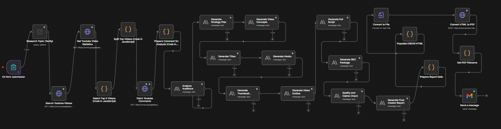
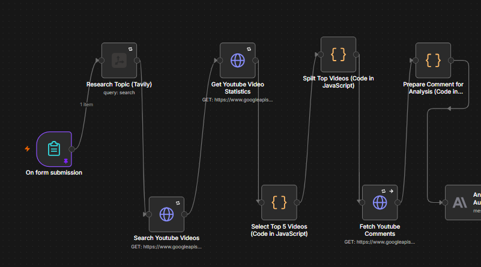
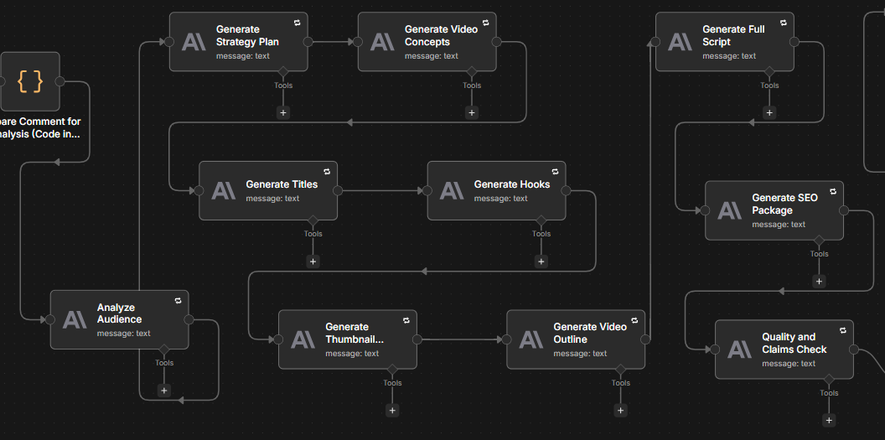
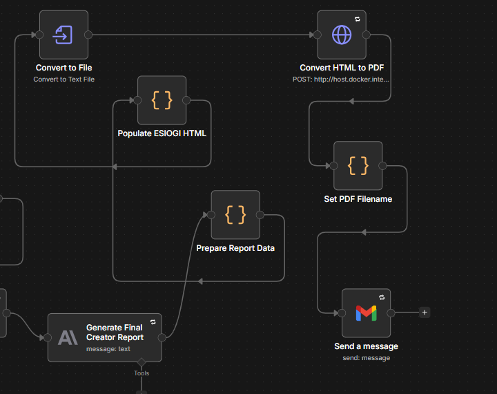
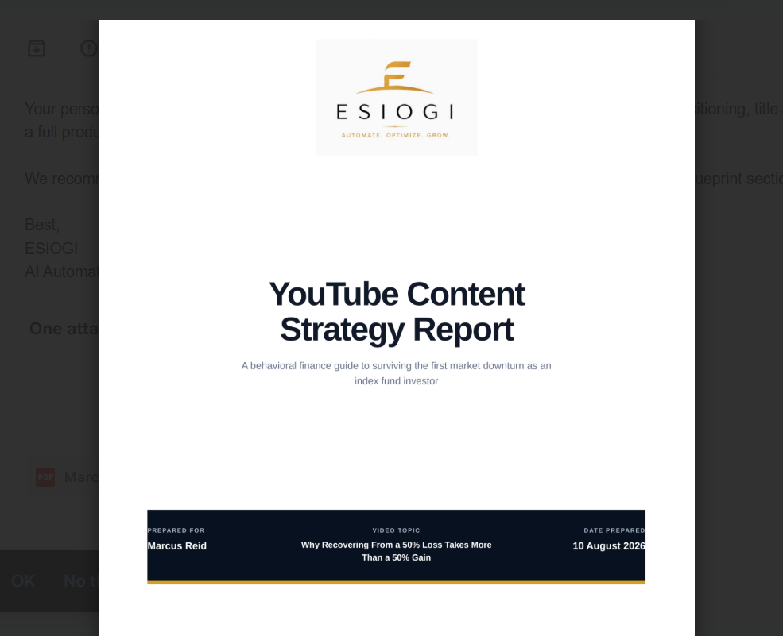
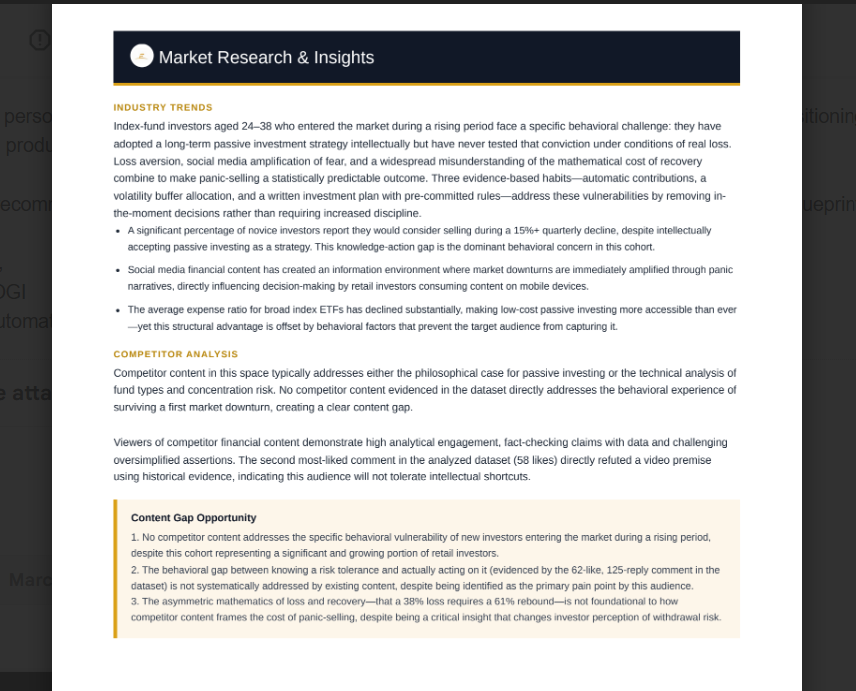
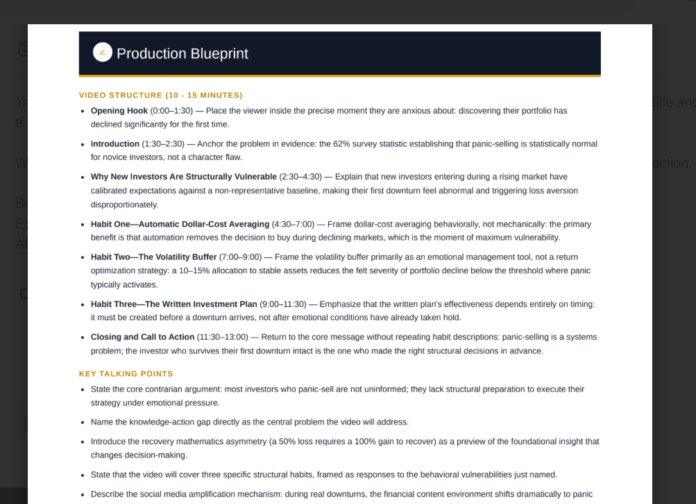

# AI YouTube Strategy Automation

## Overview
This project is a personal AI automation workflow I built using n8n to reduce the amount of manual research involved in creating YouTube strategy reports.

## The Problem
YouTube strategy research can involve a lot of repetitive work, such as reviewing channels, analyzing competitors, identifying content patterns, and turning the research into useful recommendations.

I wanted to see how much of that process I could automate using AI and workflow automation.

## What I Built
I built a multi-step n8n workflow that takes creator and channel information, gathers research data, processes the information, uses AI to analyze it, and produces a structured YouTube strategy report.

## Tools Used
- n8n
- YouTube Data API
- AI/LLM APIs
- Google APIs
- JSON
- Web research tools

## Workflow Preview

### Full Workflow
The complete n8n workflow connects data collection, research, AI analysis, strategy generation, and report creation.

### Research & Data Collection
The workflow collects and processes YouTube and competitor data before passing structured information into the analysis stages.

### AI Strategy Generation
Collected research is processed through AI-powered analysis steps to identify patterns, opportunities, and strategic recommendations.

### Report Generation
The final stages assemble the analysis into a structured strategy deliverable.

## Sample Output

Below are examples of the type of strategy report produced by the workflow.

### Generated Report

### Strategy Analysis

### Content Recommendations

## Challenges I Ran Into
While building the workflow, I ran into issues with:
- API credentials and authentication
- JSON formatting
- Node configuration
- Workflow logic
- Inconsistent AI outputs
- Report formatting

I solved these by testing the workflow step by step, checking node outputs, adjusting prompts, and troubleshooting failed executions.

## What I Learned
This project helped me understand how to break a manual process into smaller steps, connect different tools together, troubleshoot workflow errors, and improve AI outputs through testing and iteration.

## Status
This is an ongoing personal project that I am continuing to improve.
